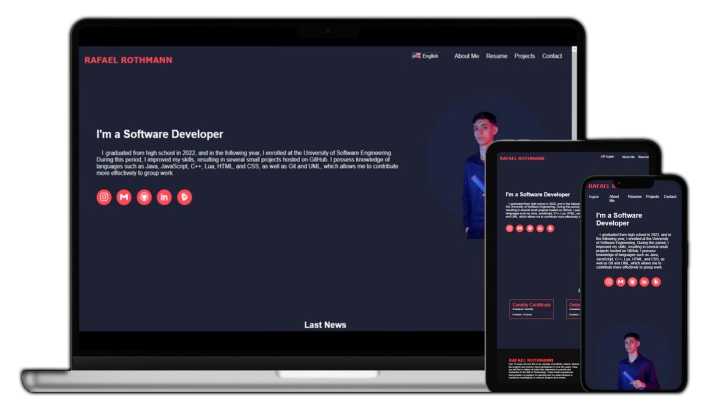

# Portifolio

  

> Português 
>
> O projeto de site online de portfólio serve como minha principal ferramenta de apresentação e demonstração da minha formação acadêmica. Desenvolvido utilizando as principais tecnologias web, como JavaScript, HTML e CSS, o site destaca não apenas meu percurso acadêmico, mas também exemplifica minhas habilidades técnicas e criativas. Com um design intuitivo e elegante, este portfólio online permite aos visitantes explorar meu histórico educacional, projetos realizados e competências adquiridas de maneira eficiente.
>
> Tecnologias usadas: JavaScript, Html, Css e Json

> English 
>
> The online portfolio website project serves as my primary tool for presentation and demonstration of my academic background. Developed using key web technologies, such as JavaScript, HTML, and CSS, the site highlights not only my academic journey but also exemplifies my technical and creative skills. With an intuitive and elegant design, this online portfolio allows visitors to efficiently explore my educational background, completed projects, and acquired skills.
>
> Technologies used: JavaScript, Html, Css and Json